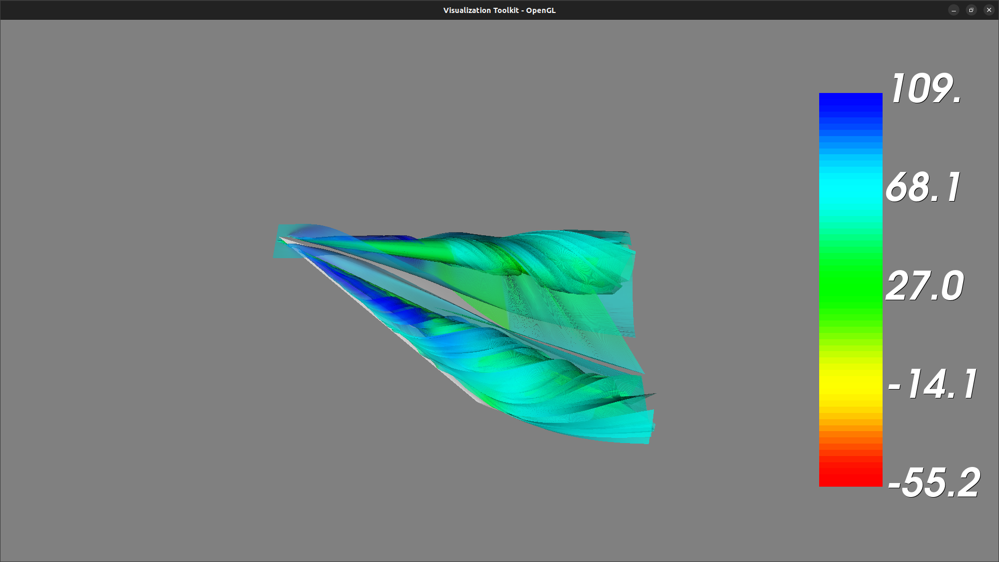

# Report

See [README.md](./README.md) for details on how to run the application.

## Task 1: Glyphs

Choosing the head, middle of the body, and tail of the wing geometry as the
locations for the planes, we can see there are two swirly patterns above the
wing.

## Task 2: Streamlines, Stream Tubes, and Stream Surfaces

### Streamlines

Selecting two locations (a 3D sphere with radius = 0.05) near the head of the
wing to be the start points for the vortex flow. Thus, the streamlines will be
spiral-shaped, which is consistent with the result in task 1.

### Stream Tubes

Selecting two locations (a 3D sphere with radius = 0.05) near the head of the
wing to be the start points for the vortex flow. Thus, the stream tubes will be
spiral-shaped, which is consistent with the result in task 1.

### Stream Surfaces

Selecting a vertical line of points near one side of the wing head to be the
center line separating the vortex flow in half. Thus, the stream surface will
curve around the flow corresponding to the result in task 1.

## Task 3: Combining Scalar and Vector Visualization

At first, we tried to draw the isosurfaces directly with the wing geometry but
the result was not very good. The isosurfaces overlapped with each other and
thus it was only able to observe the isosurface with the highest value.

To get the interesting values for the isosurfaces, we build a slider to manually
control the value of one single isosurface. We found the value between `40900.0`
and `43721.0` is the most interesting range corresponding to the vortices.

To see each isosurface clearly, we set the opacity of the isosurfaces to be
`0.5`.

## Task 4: Analysis

- Glyphs
  - Pros: Easy to understand the flow direction at a specific location.
  - Cons: Impossible to see the overall flow pattern.
- Streamlines
  - Pros: Easy to see the overall flow pattern.
  - Cons: No shading on lines, and thus hard to tell the depth of the line.
- Stream tubes
  - Pros: Has the shading of the streamlines, and thus easier to tell the depth
    of the flow pattern in 3D space.
  - Cons: Cannot have too many stream tubes, otherwise the visualization will be
    too crowded and overlapped.
- Stream surfaces
  - Pros: Represent the spiral flow pattern intuitively.
  - Cons: Cannot have too many stream surfaces, otherwise the visualization will
    be too crowded and overlapped.

By combining both streamlines and isosurfaces, we can see the vortices has a
relation with the pressure distribution. The center of the vortices is where the
pressure is the lowest, and the pressure increases as we move away from the
center of the vortices. This provides a more accurate way to understand the
location, size, and shape of the vortices.
